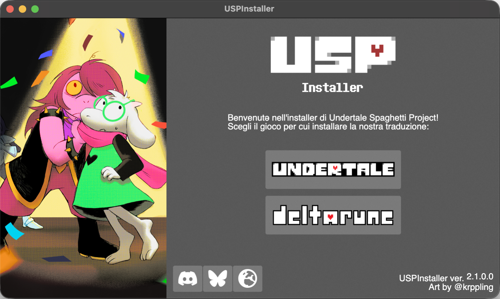

<div align="center">
	
	<figcaption>Installer su macOS</figcaption>
</div>

# USPInstaller - Patcher universale per DELTARUNE e UNDERTALE in italiano by USP

Ciao! 
Finalmente abbiamo un installer universale! Con questo potrete patchare *UNDERTALE* e *DELTARUNE* su **Windows**, **macOS** e **Linux**! Potete riutilizzare lo stesso installer per aggiornare la patch nel caso dovessimo rilasciare aggiornamenti. Insomma, conveniente! Per DELTARUNE, al momento sono tradotti in italiano i capitoli 1, 2, 3 e 4.

## Compatibilità

L'installer è compatibile con le seguenti versioni dei giochi:
- **DELTARUNE (Chaper 1 & 2 DEMO)**, versione Itch o Steam.
- **DELTARUNE (versione completa)**, testato con:
  	- DR v23
	- Capitolo 1 v1.43
	- Capitolo 2 v1.52
	- Capitolo 3 v0.0.105
	- Capitolo 4 v0.0.110
- **UNDERTALE**, v1.08

L'installer è compatibile con Windows, macOS e Linux (SteamOS incluso).

## Prerequisiti

- Se avete installato la patch in precedenza, reinstallate il gioco seguendo le istruzioni nella [sezione qui sotto](#reinstallare-il-gioco-rimuovere-la-patch).
- Trovate dove avete installato *UNDERTALE* o *DELTARUNE*; se avete il gioco su Steam potete andare in *Libreria*, cliccare col tasto destro sul gioco e selezionare *Sfoglia file locali*.
- *(Solo per Windows)* - Installate il **runtime di .NET 8.0**:
	- **Windows**: Andate sulla [pagina ufficiale](https://dotnet.microsoft.com/download/dotnet/8.0/runtime) e selezionate *Download x64* o *Download x86* sotto *Run desktop apps*, a seconda se avete un sistema a 64 o 32 bit rispettivamente, e installate il runtime seguendo le istruzioni.

## Installazione su Windows e Linux

- Scaricate [l'ultima release dell'installer](https://github.com/USPAssets/Installer/releases/latest).
- Decomprimete il contenuto del file in una cartella
- Eseguite **USPInstaller.exe** su *Windows*, eseguite **USPInstaller_Linux_x86_64.AppImage** su *Linux*.
	- Potreste essere bloccati da dei pop-up di sicurezza su Windows. Potete leggere la sezione [*Risoluzione problemi*](#risoluzione-problemi) per come aprire l'installer in questi casi.
- Scegliete il gioco per cui volete installare la patch.
- L'installer ora proverà a cercare il gioco nella libreria di default di Steam e se presente metterà già il percorso, altrimenti potete inserire voi il percorso all'eseguibile del gioco:
	- **(Windows/Linux)**: Cliccate su **Sfoglia** e selezionate, dalla cartella dove avete installato il gioco, il file **DELTARUNE.exe** o **UNDERTALE.exe**.
		- **NOTA PER UNDERTALE E LINUX**: UNDERTALE ha una versione nativa su Linux. Se la state utilizzando, potete selezionare in quel caso *runner* o *run.sh* nella directory del gioco. 
- Cliccate **Avvia installazione!**, e attendete che la patch venga applicata.
- Appena sarà tutto concluso, il vostro gioco sarà tradotto! Potete ora avviarlo e giocare.

## Installazione su macOS

- Aprite l'applicazione **Terminale** (potete trovarla premendo `command+spazio` e scrivendo _Terminale_).
- Copiate e incollate il comando seguente nella finestra del Terminale.
	- Se siete su un Mac con processore Silicon (M1, M2, M3, etc.), copiate e incollate il seguente comando:
	```
	curl -fsSL "https://github.com/USPAssets/Installer/releases/latest/download/USPInstaller_macOS_arm64.tar" | tar -xzf - -C /Applications
 	```
	- Altrimenti, copiate e incollate il seguente comando:
	```
	curl -fsSL "https://github.com/USPAssets/Installer/releases/latest/download/USPInstaller_macOS_x64.tar"  | tar -xzf - -C /Applications
	```
- Premete **Invio**, il comando dovrebbe metterci pochi secondi e non emettere nessun messaggio.
- Eseguite **USPInstaller**, che troverete ora in _Applicazioni_.
	- Potreste essere bloccati da dei pop-up di sicurezza. Potete leggere la sezione [*Risoluzione problemi*](#risoluzione-problemi) per come aprire l'installer in questi casi.
- Scegliete il gioco per cui volete installare la patch.
- L'installer ora proverà a cercare il gioco nella libreria di default di Steam e se presente metterà già il percorso, altrimenti potete inserire voi il percorso all'eseguibile del gioco.
- Copiate e incollate il percorso di **UNDERTALE.app** o **DELTARUNE.app** nel box. Potete cliccare col tasto destro sull'app, tenere premuto il pusalnte *Opzione* sulla tastiera e cliccare su *Copia nome_del_file come percorso*. Se il percorso contiene virgolette all'inizio e alla fine, toglietele.
- Cliccate **Avvia installazione!**, e attendete che la patch venga applicata.
- Appena sarà tutto concluso, il vostro gioco sarà tradotto! Potete ora avviarlo e giocare.

## Reinstallare il gioco (rimuovere la patch)

Il modo migliore di rimuovere la patch è reinstallare il gioco (i vostri salvataggi rimarranno intatti). Su Steam, potete eseguire i seguenti passaggi:
- Tasto destro sul gioco in *Libreria*.
- Cliccate su *Proprietà*.
- Nella barra a sinistra cliccate su *File installati*.
- Cliccate su *Verifica integrità dei file del gioco*.

A questo punto Steam provvederà a riscaricare il gioco e la patch sarà rimossa! 

## Risoluzione problemi

- Se su Windows ricevete un avviso durante l'installazione che vi dice che il file va prima estratto, seguite la guida apposita [qui](https://github.com/USPAssets/Installer/blob/main/GUIDA_ESTRAZIONE_UT.md).
- Se quando provate ad eseguire l'exe su Windows vi si apre un pop-up di *Windows SmartScreen*, cliccate su *Ulteriori Informazioni*, e poi su *Esegui comunque*.
- Se su macOS ricevete un avviso che non vi permette di aprire l'installer, seguite le [istruzioni di Apple](https://support.apple.com/it-it/102445) per aprire l'app, con particolare attenzione alla sezione *Se vuoi aprire un'app non autenticata o proveniente da uno sviluppatore non identificato*.
- Se l'installer vi avvisa che state installando la patch sulla versione demo di DELTARUNE, ma in realtà siete sulla versione completa, potrebbero esserci conflitti a causa di altre mod installate in precedenza. Vi basta rispondere 'No' e l'installazione procederà normalmente.

## Domande frequenti

- Devo scaricare di nuovo l'installer?
	- No, se il vostro installer è almeno alla versione 2.0.0 (puoi vederlo in basso a destra quando lo apri), non serve che lo scarichi di nuovo. Se sei in dubbio, [scaricarlo di nuovo non fa male](https://github.com/USPAssets/Installer/releases/latest).
- Ho già installato la traduzione per Capitolo 1 e 2, posso eseguire l'installer direttamente?
	- Raccomandiamo sempre di reinstallare il gioco prima di riapplicare la patch, le istruzioni sono [qua sopra](#reinstallare-il-gioco-rimuovere-la-patch), i vostri salvataggi non verranno toccati.

## Note aggiuntive 

L'installer non potrebbe esistere senza [UndertaleModTool](https://github.com/UnderminersTeam/UndertaleModTool). Un grazie speciale a tutte le persone che hanno contribuito al progetto!

Se doveste avere problemi, unitevi al [nostro Discord](https://discord.gg/YrEkAJ5MrG) dovete potete comunicare con noi in modo piu diretto.

A presto!

*Renard*
